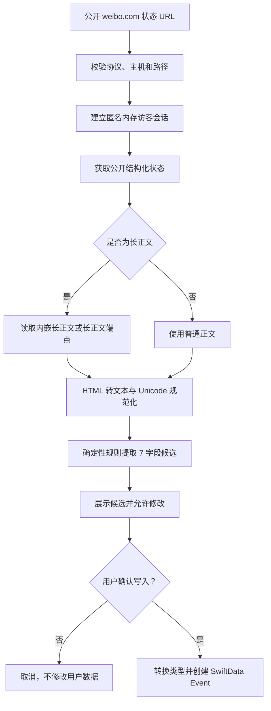

# 从公开 Weibo URL 创建 Event

本文说明如何使用仓库现有的确定性提取器，将一条公开的
`weibo.com` 状态链接转换为 Event 候选数据，以及未来接入 iOS App 时应如何
完成预览、确认和持久化。

相关实现：

- 提取器：[`scripts/event_weibo_extractor/event_weibo_extractor.py`](../scripts/event_weibo_extractor/event_weibo_extractor.py)
- 使用说明：[`scripts/event_weibo_extractor/README.md`](../scripts/event_weibo_extractor/README.md)
- 规则测试：[`scripts/event_weibo_extractor/test_event_weibo_extractor.py`](../scripts/event_weibo_extractor/test_event_weibo_extractor.py)
- App Event 模型：[`ios/Chekinana/Chekinana/ChekinanaDataModel.swift`](../ios/Chekinana/Chekinana/ChekinanaDataModel.swift)

## 当前实现边界

当前脚本已经实现：

1. 验证公开 Weibo 状态 URL。
2. 建立匿名、仅存于内存的 Weibo 访客会话。
3. 获取结构化状态数据和长正文。
4. 规范化正文并按确定性规则提取 Event 候选字段。
5. 通过命令行或 Python 函数返回 JSON 兼容结果。

当前脚本**尚未实现**：

- 集成到 iOS App 或任何 API。
- 创建、更新或保存 SwiftData `Event`。
- 候选卡片、字段编辑和用户确认 UI。
- 自动重试、任务队列、缓存、登录态或批量同步。

因此，脚本输出只能视为候选数据。未来接入 App 时，必须先让用户检查和修改
候选字段；只有用户明确确认后，才能写入用户数据。

## 输入与输出契约

输入是一条公开状态链接，例如：

```text
https://weibo.com/<public-user-id>/<public-status-id>
```

提取器返回且只返回以下 7 个字符串字段。表中的“规则”是创建 Event 时要满足的
**目标契约**；当前提取规则存在下方列出的已知差异，因此脚本结果只能作为候选：

| 字段 | 规则 |
| --- | --- |
| `name` | 活动名称；无法可靠确定时为空字符串 |
| `date` | `YYYY-MM-DD`；目标是在缺失或无法消除歧义时留空 |
| `city` | 正文明确支持的城市；不根据账号所在地推断 |
| `livehouse` | 只保存场地名称，可保留“XX店”或“中大二号馆”等分店/场馆后缀，不保存详细地址 |
| `weiboURL` | 原始输入 URL |
| `ticketURL` | 仅接受受信任票务域名或安全解析出的票务 URL |
| `note` | 始终为空字符串 |

目标契约要求缺失字段留空，不根据图片、常识或账号资料补全。

> **当前实现差异，接入前必须处理：**
>
> - 带年份的多个日期候选不会因歧义自动留空；脚本会按上下文得分和位置选择
>   其中一个。只有多个不同的无年份“月-日”候选会保守留空。
> - `livehouse` 的显式标签回退可能把完整地址作为场地候选。例如
>   `演出地址：北京市朝阳区幸福路100号` 当前会得到
>   `北京市朝阳区幸福路100号`。
>
> App 必须展示并允许用户检查、修改这些候选；不得把详细地址直接保存为
> `livehouse`。上述两项还需要后续修改源规则并增加回归测试，本次文档任务没有
> 修改代码。

App 中的 `Event` 模型包含：

```text
id, name, date, city, livehouse, weiboURL, ticketURL, note,
chekis, createdAt, updatedAt
```

其中 `id`、`chekis`、`createdAt` 和 `updatedAt` 不属于提取器输出，应在用户
确认创建时由 App 生成。

## 完整处理流程



图中从 URL 到“7 字段候选”已由独立脚本实现；“展示候选”之后属于建议的 App
接入步骤，目前没有实现。

## 1. URL 校验

`_status_reference` 在任何网络请求之前执行以下检查：

- 协议必须是 `http` 或 `https`。
- 主机必须精确为 `weibo.com` 或 `www.weibo.com`。
- 路径至少包含两段，并按 `/<user-id>/<status-id>` 取最后两段。
- `<status-id>` 只能包含 ASCII 字母和数字。

不符合条件时抛出 `ValueError`，不会把任意外部 URL 当作微博状态请求。

## 2. 匿名访客会话与状态获取

`WeiboVisitorClient` 使用 Python 标准库建立匿名访客会话：

1. 创建进程内 `CookieJar`，不从磁盘读取 Cookie。
2. 调用 Weibo 的访客身份生成端点。
3. 调用访客身份落地端点，让同一个内存会话获得访问公开数据所需的访客状态。
4. 请求公开状态端点 `ajax/statuses/show`。
5. 若状态标记为长正文，优先使用状态内嵌的 `longTextContent`；若未内嵌，继续请求
   `ajax/statuses/longtext`。
6. 收集状态的 `created_at` 和 `url_struct`，供日期推断和票务 URL 判断使用。

访客 Cookie 只存在于当前 Python 进程的内存中，不打印、不记录、不持久化。该流程
不登录微博，也不使用用户账号、浏览器会话或项目秘密。

## 3. 正文规范化

提取前会进行以下处理：

- 将 HTML 块级标签和 `<br>` 转换为换行并解码 HTML 实体。
- 去除空行、零宽字符、BOM 和不换行空格。
- 合并行内多余空白。
- 去除 Weibo 长正文传输中可能出现在行边缘的反斜杠装饰。
- 保留一份 NFC 原文用于输出，同时使用 NFKC 版本参与匹配。因此全角数字和
  全角日期分隔符可以按普通数字处理，而标题原有字符尽量保留。
- 将行首、行尾的常见 emoji 和装饰符视为展示装饰。

脚本不分析图片，也不执行 OCR。

## 4. 字段提取规则

### name

名称按以下优先级寻找，命中可靠候选后停止：

1. `活动名称：`、`演出名称：`、`公演名称：`、`标题：`、`主题：` 或
   `event:` 等显式标签。
2. 独占一行的 `【标题】`。如果下一行是“生诞祭”“定期公演”等标题延续，会合并
   两行。
3. “活动类型 + 『主题』”等同一行或相邻行结构。
4. 相邻两行的标题组合，其中后一行含“周年”“ONE MAN”“FES”“LIVE”或
   `VOL.n` 等活动信号。
5. 单行含明确活动信号的标题。
6. 在“活动情报”等通用标题之后、第一条有效活动日期之前的非元数据文本。

“活动信息”“情报解禁”“Timetable 公布”等通用标题不会被当作名称；抽奖、中奖、
票价、开售、免费入场等文本也会被排除。最终无法得到可靠名称时返回空字符串，
不能直接创建缺少必填 `name` 的 App Event。

### date

日期规则如下：

- 优先识别带年份的 `YYYY-MM-DD`、`YYYY/MM/DD`、`YYYY年M月D日` 等格式。
- `日期：`、`演出时间：` 等显式上下文优先于普通正文；带星期标记的候选也会提高
  优先级。同分时正文中较早出现的候选优先。
- 对只含月日的日期，使用微博 `created_at` 的年份；如果推导日期比发布日期早
  180 天以上，则尝试下一年。
- 同一正文出现多个不同的无年份“月-日”候选时返回空字符串。
- 含“开售”“发售”“购票”“抽奖”“截止”等词的行不作为活动日期。
- 票价和非法日历日期会被排除。

输出固定为 `YYYY-MM-DD`，不保存活动时间。当前实现会对所有有效的带年份候选
评分，并选择排序最高的一个；显式日期/时间标签加 60 分，星期上下文加 25 分，
同分时先比较正文位置，位置也相同时再按日期字符串排序。它不会先验证带年份候选
是否唯一。例如：

```python
extract_event_from_text(
    "2026-07-04 或 2026-07-05",
    weibo_url="https://weibo.com/123/AbC",
).date
# 当前返回 "2026-07-05"，而不是空字符串
```

因此，目标契约中的“跨日、多日或歧义时留空”尚未完全实现。App 接入时必须让用户
确认日期，且后续应修正规则并为带年份的多日期正文增加回归测试。

### city

城市按以下优先级提取：

1. `城市：`、`演出城市：` 等显式标签。
2. 含“地址”“场地”“地点”“会场”等上下文的正文行。
3. 正文中的“上海站”“长沙场”等站次标记。
4. 独占一行的城市名。

只接受脚本城市表中的明确名称。不会把标题中的“上海滩”等普通文本当作城市，
也不会使用微博账号的 `region_name` 推断活动城市。

### livehouse

场地按以下优先级提取：

1. `演出场地：`、`地点：`、`会场：`、`venue:`、`ADD:` 等显式标签。
2. 以定位 emoji 开头的行。
3. 地址行末尾括号中明确隔离的场地。
4. 正文中带 `Livehouse`、`空间`、`剧场`、`馆`、`店` 等场地后缀的候选。

若详细地址后存在脚本可以识别的清晰场地尾部，通常会只返回场地名称；括号中的
分馆或“XX店”后缀会被保留。普通“餐厅”“客厅”“酒店”以及“演出后一起去
火锅店”一类句子会被排除。

但显式场地/地址标签还有一个字面值回退：主要场地规则无法匹配、且该行通过通用
安全检查时，会直接接受标签后的文本。这意味着纯详细地址可能成为候选：

```python
extract_event_from_text(
    "演出地址：北京市朝阳区幸福路100号",
    weibo_url="https://weibo.com/123/AbC",
).livehouse
# 当前返回 "北京市朝阳区幸福路100号"
```

这不符合“`livehouse` 只保存场地名称”的目标契约。App 必须让用户检查/修改，并在
写入前拒绝把地址当作 `livehouse`；后续还应修正源规则并增加该输入的回归测试。

### ticketURL

票务链接只从 Weibo 结构化 `url_struct` 中提取，不从“秀动搜索某活动”等纯文本
提示猜测。当前直接允许的票务域包括：

- `showstart.com`
- `damai.cn`
- `piaoxingqiu.com`
- `maoyan.com`
- `247tickets.com`
- `gewara.com`
- `motntickets.com`
- `cityline.com`
- `hkticketing.com`

子域名也可接受。对于 `t.cn` 和 `sinaurl.cn`，脚本关闭自动重定向，只检查第一跳
的 `Location`；仅当目标仍为 `http/https` 且属于上述票务域时才接受。不会继续
跟随第二跳，也不会请求任意非受信任目标。微博抽奖链接或其他外部链接不会被当成
票务链接。

### weiboURL 与 note

`weiboURL` 原样保存输入 URL。`note` 无论正文内容如何都固定为空字符串。

## 5. 将候选转换为 App Event

以下是未来 App 接入时应采用的转换契约，不代表当前已经实现：

| 提取器候选 | App Event | 转换方式 |
| --- | --- | --- |
| `name` | `name: String` | 必填；为空时要求用户填写，不得直接保存 |
| `date` | `date: Date?` | 先由用户核对是否为唯一活动日期；非空时按 `YYYY-MM-DD` 解析，空字符串转 `nil` |
| `city` | `city: String?` | 空字符串转 `nil` |
| `livehouse` | `livehouse: String?` | 先由用户确认是场地名称而非地址；空字符串转 `nil` |
| `weiboURL` | `weiboURL: URL?` | 构造 URL；构造失败则阻止保存或要求用户修正 |
| `ticketURL` | `ticketURL: URL?` | 空字符串转 `nil`，非空时构造 URL |
| `note` | `note: String` | 初始值为空，可在候选阶段编辑 |
| 无 | `id: UUID` | 用户确认创建时生成 |
| 无 | `chekis: [Cheki]` | 初始为空数组 |
| 无 | `createdAt`, `updatedAt` | 用户确认创建时设为当前时间 |

推荐的产品流程是：提取候选 → 展示全部可编辑字段 → 用户修改 → 显式确认 →
一次性插入 SwiftData。保存前至少要检查带年份的多日期歧义，并确保 `livehouse`
不是详细地址。取消确认、提取失败、必填名称仍为空或候选未通过检查时，都不修改
用户数据。

## 6. 使用方式

在仓库根目录运行单条 URL：

```sh
python3 scripts/event_weibo_extractor/event_weibo_extractor.py \
  'https://weibo.com/<public-user-id>/<public-status-id>'
```

正常输出示例：

```json
{
  "name": "示例公演",
  "date": "2026-08-02",
  "city": "合肥",
  "livehouse": "示例Livehouse",
  "weiboURL": "https://weibo.com/<public-user-id>/<public-status-id>",
  "ticketURL": "",
  "note": ""
}
```

可以一次传入多条 URL，并覆盖默认 20 秒网络超时：

```sh
python3 scripts/event_weibo_extractor/event_weibo_extractor.py \
  --timeout 10 \
  'https://weibo.com/<public-user-id>/<public-status-id-1>' \
  'https://weibo.com/<public-user-id>/<public-status-id-2>'
```

多条输入时，标准输出是成功结果数组。失败项以 `{weiboURL, error}` 写入标准错误，
只要存在失败项，进程退出码就是 `1`；其他 URL 仍会继续处理。

也可以从 Python 调用：

```python
from scripts.event_weibo_extractor.event_weibo_extractor import (
    WeiboVisitorClient,
    extract_event,
)

client = WeiboVisitorClient(timeout=20.0)
candidate = extract_event(
    "https://weibo.com/<public-user-id>/<public-status-id>",
    client=client,
)
payload = candidate.as_dict()
```

复用同一个 client 可以让多条公开状态共享同一个进程内匿名访客会话，但不要在
日志中输出 client 的 CookieJar。

## 7. 错误、超时与重试

已实现的错误行为：

- URL 形状错误：抛出 `ValueError`。
- `_json_request` 中的 HTTP、Unicode 解码和 JSON 解码失败会包装为
  `WeiboFetchError`；状态不可用、正文为空以及若干响应结构异常也会显式抛出
  `WeiboFetchError`。
- 访客 `_bootstrap` 只包装其当前 `except` 覆盖的网络/HTTP/JSON 解码异常。
  访客响应的字符编码异常或意外数据形状仍可能以 `UnicodeDecodeError`、
  `AttributeError` 等未包装异常逃逸。
- 单次请求使用 client 的超时值，CLI 默认 20 秒。
- CLI 只捕获 `ValueError` 和 `WeiboFetchError`，对捕获到的异常直接使用
  `str(exc)` 生成标准错误中的 `error` 字段，没有通用错误脱敏器；只要出现这些
  已捕获失败，退出码就是 `1`，其他 URL 会继续处理。未包装异常可能终止进程。

当前没有自动重试。未来调用方应在调用边界兜底未包装异常，并确保对外日志经过
独立脱敏，不能假设脚本已经完成统一包装或脱敏。调用方可以只对超时、临时网络
失败或服务端临时错误进行有限次数、指数退避的重试；URL 无效、状态不可用、正文
为空和规则提取结果为空不应盲目重试。重试仍应复用匿名内存会话，并设置并发和
速率上限，避免对公开端点造成不必要的压力。

## 8. 已验证的 idollog.top 来源样本

此前从 idollog.top 的公开 Event 数据取得来源记录，再沿公开来源页得到以下 Weibo
状态 URL。表中是当时用本提取器得到并人工核对的结果；空值表示正文证据不足，不是
抓取时的默认补全。

| 来源记录 | name | date | city | livehouse | weiboURL |
| --- | --- | --- | --- | --- | --- |
| `ievent-10090` | TriMoment Fes Vol.5「安然入梦」 安悦Anna生诞祭 | `2026-08-09` |  | 瓦肆VAS ear NC | <https://weibo.com/7408614757/R6wjasacT> |
| `ievent-10232` | 糖分补充企划VOL.22&23 凛音/词烟&saki生日sp |  | 合肥 | 回响之地·合肥馆 | <https://weibo.com/7486395503/R8w4Iizml> |
| `ievent-10254` | SMO Idol Live Vol.4 | `2026-08-02` | 合肥 | 791Crow | <https://weibo.com/8020129235/R8FjiCS5Z> |
| `ievent-10108` | 霓虹信号NeonEyEs 一周年one man live | `2026-07-24` |  |  | <https://weibo.com/8013540569/5315816205587459> |

这 4 条样本的 `ticketURL` 和 `note` 都为空。`ievent-10232` 的正文描述双日活动，
无法选择唯一日期，因此日期按契约留空。

## 9. 安全与隐私要求

- 只处理用户有权访问的公开状态 URL，不尝试绕过登录、权限、删除或地区限制。
- 不读取或复用浏览器 Cookie、微博账号、`apikey.txt`、Secrets 或其他凭证。
- 不打印、持久化或提交匿名访客 Cookie。
- 当前请求路径不会主动把完整响应正文写入日志，但 CLI 对已捕获异常直接输出
  `str(exc)`，没有通用脱敏器。App 或服务端接入层必须自行限制错误字段并执行脱敏。
- 不使用图片、OCR、浏览器自动化或大模型补全字段。
- 票务短链最多检查一跳，且目标域必须在允许列表内，以避免把任意短链当作票务
  地址或跟随到内部/非预期资源。
- 实际接入批量任务时应限制并发和频率，并接受公开端点可能拒绝匿名访问。

## 10. 验证

运行现有单元测试：

```sh
python3 -m unittest discover \
  -s scripts/event_weibo_extractor \
  -p 'test_*.py'
```

当前测试集包含 48 项测试，覆盖字段契约、名称组合与排除、全角和歧义日期、城市
证据、场地/分店后缀、抽奖与票务链接区分、短链安全、URL 校验及访客回调解析。

网络端点可能变化，因此单元测试通过不等于实时抓取一定成功。接入 App 前还应在
不使用登录态的前提下，用少量公开 URL 做受控的实时烟雾验证，并人工检查候选字段；
这类验证不应写入用户数据。

## 11. 已知限制

- 只解析微博正文和结构化链接；关键信息仅存在于海报图片时，对应字段会为空。
- 单一 `date` 模型无法完整表达多日或多场次。多个不同的无年份月日会留空，但多个
  带年份日期当前仍会选出一个候选，可能产生错误日期；必须人工确认并等待源规则修复。
- 场地或城市没有明确标签、定位符或已知语言结构时，可能漏提取。
- 显式场地/地址标签的字面回退可能把完整地址作为 `livehouse`；App 不得未经人工
  检查直接持久化该候选，源规则仍需修复。
- 自由格式标题可能被通用标题/抽奖排除规则拒绝，也可能因缺少活动信号而留空。
- 票务域允许列表之外的真实票务链接会被保守地忽略。
- Weibo 的匿名访客、状态和长正文端点属于外部行为，路径、响应结构、访问限制和
  速率策略均可能变化。
- 删除、转为仅粉丝可见、受地区限制或需要登录的微博无法由该公开流程处理。
- 访客初始化的部分编码或响应形状异常尚未统一转换为 `WeiboFetchError`，CLI 也没有
  通用错误脱敏器；接入层需要兜底和脱敏。
- 当前 Event 模型只能保存一个日期、一个城市和一个 livehouse；复杂巡演需要用户
  拆分或等待模型契约扩展。
